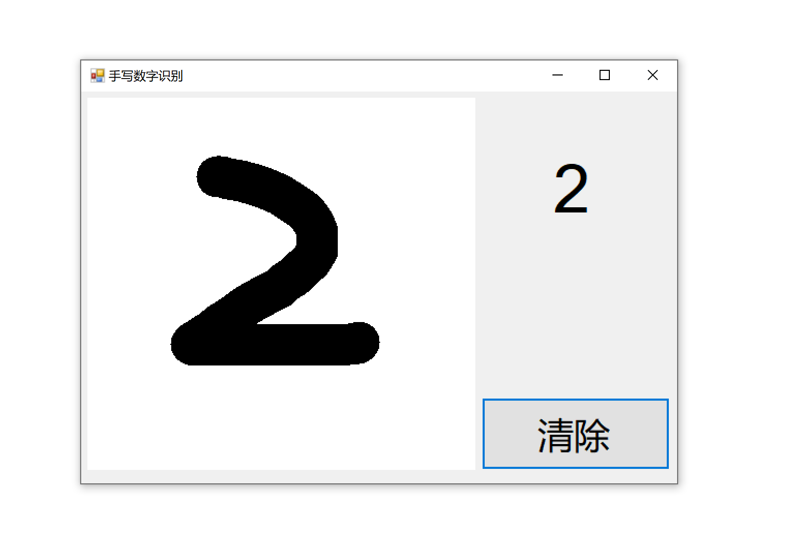
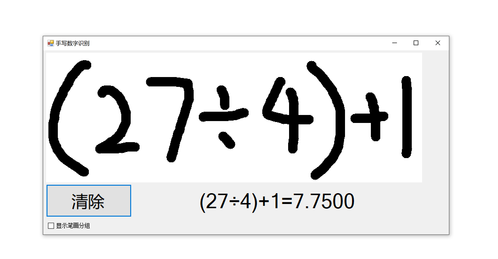
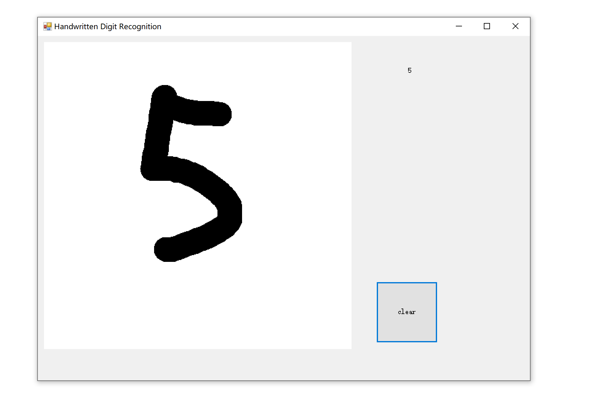
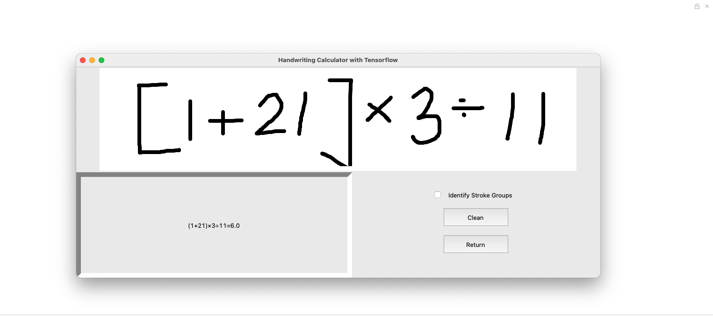
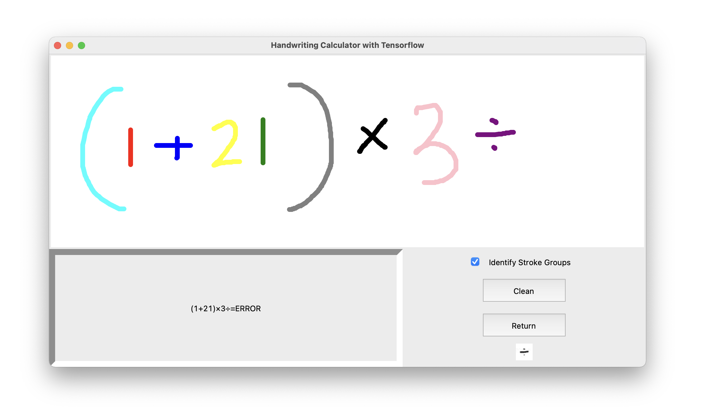

## task1

运行效果：





根据官方指导中的脚本安装好环境。

```bash
cd task1/mnist
```

双击MnistDemo.sln即可运行手写数字识别

```bash
cd task1/extended_mnist_calculator
```

双击MnistDemo.sln即可运行手写算式识别与运算

## task2

运行效果：



用pythonnet调用.NET框架中的dll库，继承其中的System.Windows.Forms类并自定义前端界面，在调用model.dll中的函数来进行预测，并显示于前端。

代码参照task1中手写数字识别的代码逻辑使用python进行改写。

#### 运行方法

将packages文件夹复制一份放入task1目录下

```bash
cd task2/src
```

进入目录后双击MnistDemo.sln，在界面中运行项目即可。

## task3

运行效果：





### 数据处理

采用了[哈工大暑期项目的开源数据](https://blog.csdn.net/qq_34919953/article/details/81048259)的运算符数据集，并对其进行了扩充处理：

1. 将原数据集的每张照片随机增加了1%-5%的噪点，噪点的灰度为(128,255)之间的随机值。
2. 将每张照片随机压缩到原来大小的50%-96%不等，然后填充白色像素维持图片大小不变
3. 将每张照片旋转一定角度，填充白色像素点维持照片大小不变。

除了以上经过处理的数据集之外，还以1:1为比例搭配了原数据集，整合成为完整的训练集。

代码实现见data_process.py文件

但是这样处理出来的模型有一定的问题：难易分辨数字1，7和括号。通过查看比对数据集原图，我们推测是因为数据集中的1，7和括号的书写过于相似，再加上我们进行了旋转处理，这更加增进了数字与括号的相似度。考虑到这是一个多分类问题，我们希望类与类之间的差距更大。于是我们想到了可以用方括号（中括号）来代替圆括号。这么做的合理性在于：尽管方括号并不是我们手写时采用的格式，但是圆括号相比起数字1和7，与方括号更加相似；而数字则更加不同于方括号。这样一来可以拉开类与类之间的间距，让识别更加准确。

我们找到了kaggle上[包含方括号的符号数据集](https://www.kaggle.com/michelheusser/handwritten-digits-and-operators)，采用其中的左右方括号数据集来代替我们原本数据集中的圆括号，进行了训练，识别准确率有明显提升。

对于应用的搭建，我们利用了Python的GUI库tkinter，实现了清除屏幕，回退上一步的交互功能，同时有区分主体，显示不同颜色的选项。主体重叠分割的规则与C#版本的算法一致，都是竖向投影，设定10%的阈值。

处理计算的双栈结构逻辑，即将识别的字符式子计算成数字的部分以及主提分割的部分具体实现，参考了@LogCreative，已与原作者沟通并在代码中标明。

